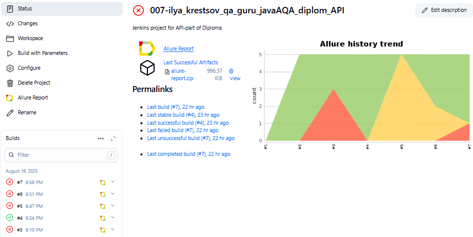
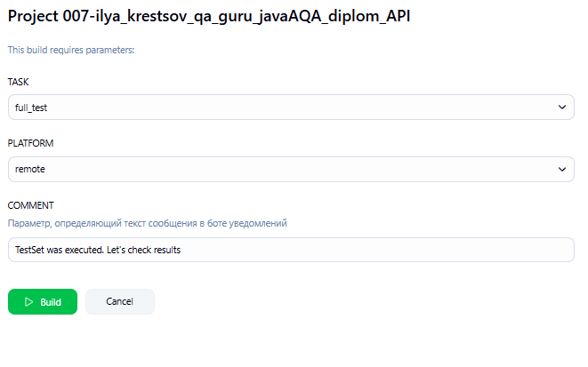
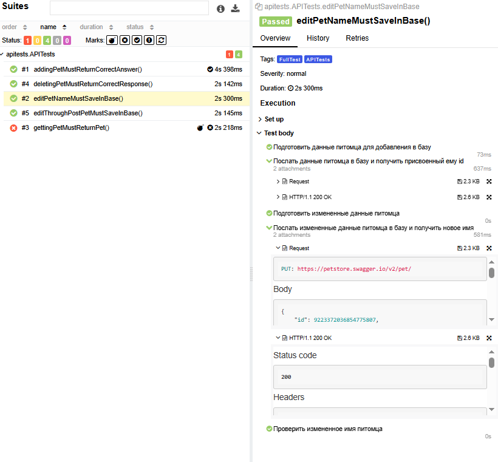
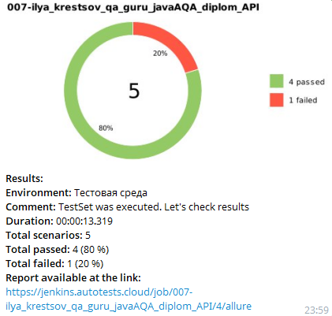

# 
Дипломный проект 

## 
API-часть на примере сайта-тренажера для API-тестов [petstore](https://petstore.swagger.io/#/)

### 
С UI-частью можно ознакомиться по [ссылке](https://github.com/KrestIV/QAGuru_diplom_ui)

# Содержание

- [Стек технологий](#стек-технологий)
- [Список тестов](#список-тестов)
- [Jenkins](#jenkins)
- [Запуск автотестов](#запуск-автотестов)
- [Allure-отчет](#allure-отчеты)
- [Уведомления в телеграм](#уведомления-в-телеграм)

## Стек технологий

  

Автотесты в проекте написаны на <code>Java</code> с использованием
библиотеки [REST-assured](https://rest-assured.io/),  
сборщик - <code>Gradle</code>,  
фреймворк модульного тестирования - <code>JUnit 5</code>,  
удаленный запуск браузера и прохождение сценариев - [Selenoid](https://aerokube.com/selenoid/),  
управление удаленным запуском, настройка параметров и формирование отчета - <code>Jenkins + Allure</code>.  
Реализована отправка результатов в <code>Telegram</code> при помощи бота.

### Список тестов

**addingPetMustReturnCorrectAnswer** - Тест создания записи нового питомца в базе магазина  
**gettingPetMustReturnPet** - Тест получения информации о питомце по его id  
**deletingPetMustReturnCorrectResponse** - Тест удаления питомца  
**editPetNameMustSaveInBase** - Тест редактирования клички питомца  
**editThroughPostPetMustSaveInBase** - Тест изменения статуса питомца

### Jenkins

Настройка, запуск и переход к результатам запуска автотестов осуществляется
в [Jenkins](https://jenkins.autotests.cloud/job/007-ilya_krestsov_qa_guru_javaAQA_diplom_API/)

### Запуск автотестов

Автотесты запускаются сборкой в <code>Jenkins</code> с заполнением параметров выполнения

  

- **TASK** - Параметр, определяющий набор тестов для запуска
- **PLATFORM** - Платформа для выполнения автотестов
- **SERVER** - Адрес сервера выполнения тестов
- **LOGIN** - Логин для доступа к серверу выполнения тестов
- **PASSWORD** - пароль для доступа к серверу выполнения тестов
- **COMMENT** - Параметр, определяющий текст сообщения в боте уведомлений

### Allure-отчеты

Allure-отчет содержит в себе результаты выполнения всех тестов с полной информацией об отправленных запросах и
полученных на них ответов

[Пример полного allure-отчета](https://jenkins.autotests.cloud/job/007-ilya_krestsov_qa_guru_javaAQA_diplom_API/allure/)

### Уведомления в телеграм

По завершении выполнения тестов отправляется краткий отчет в телеграм-бот со ссылкой на полный allure-отчет

### 
С UI-частью можно ознакомиться по [ссылке](https://github.com/KrestIV/QAGuru_diplom_ui)
